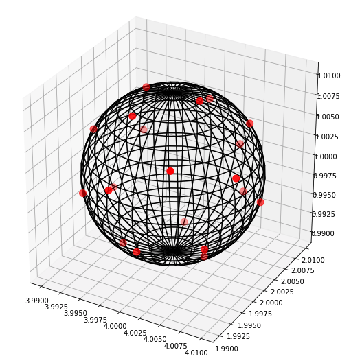
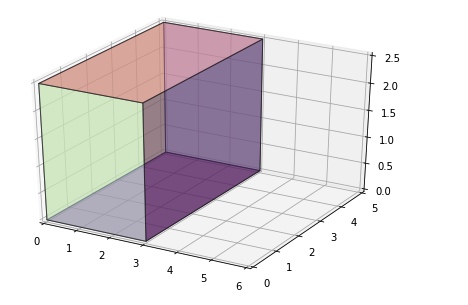
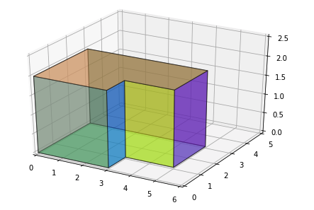

# Benchmark SSL 

We design in what follows a benchmark to characterize and compare sound source localization algorithms. We use different setups to assess the performances of the algorithms in different situations. The two algorithms benchmarked are the **_`ML-TDOA`_** and **_`SRP-PHAT`_**.

**_`ML-TDOA`_**  
Two steps approach. First the Time Difference of Arrival (TDOA) is derived from the Generalized Cross Correlation (GCC) function. Then the ML location estimate can be shown to be the position which minimizes the least squares error criterion. 

**_`SRP-PHAT`_**  
The algorithm can be interpreted as a beamforming-based approach that searches for the candidate position that maximizes the output of a steered delay-and-sum beamformer. It consists in a grid-search procedure that evaluates the objective function on a grid G of candidate source locations to estimate the spatial location of the sound source, as the point of the grid that provides the maximum SRP.

- [I - Shoe Box Room](#sbr)
- [II - L-Shaped Room](#lsr)
- [III - Remarks](#rmk)

## I - Shoe Box Room

Shoe box room are rectangular parallelepiped. In this situation, source occlusion can't happen. 
Microphones are placed around a sphere of radius $10 cm$ at the center of the room and the source is placed at the position $(1,1,1)$

**Constants**

- Room Dimensions : $3m * 5m * 2.5m$
- Max Order : $4$
- Absorbtion factor : $0.2$ (for all walls)
- Number of sources : $1$

### 1. Setup n°1 : 5 microphones

**Results**

- **_`ML-TDOA`_** : on average the $L2$ Distance between ground truth position and recovered postion is : $60 cm$
- **_`SRP-PHAT`_** : on average the $L2$ Distance between ground truth position and recovered postion is: $2 cm$

### 2. Setup n°2 : 50 microphones

**Results**

- **_`ML-TDOA`_** : on average the $L2$ Distance between ground truth position and recovered postion is: $40 cm$
- **_`SRP-PHAT`_** : on average the $L2$ Distance between ground truth position and recovered postion is: $2 cm$

### 3. Conlusion

From these 2 setups we can observe that by increasing the number of microphones the accuracy of the *ML-TDOA* algorithm has increased. However, *SRP-PHAT* always performs better than *ML-TDOA*, this difference of performance can be explained by the fact that the beamforming-based approach (*SRP-PHAT*) is robust in adverse acoustic environments.

## II - L-Shaped Room

In this context source oclusion could happen, and we will model it to see how both algorithm perform.
Again, microphones are placed around a sphere of radius $10 cm$ but this time at position $(4, 2, 1)$

**Constants**

- Surface dimensions : $(3m, 3m, 5m, 2m, 2m, 1m)$
- Elevation : $2m$
- Max Order = $4$
- Absorbtion factor = $0.2$  (for all walls)
- Number of Sources: $1$ 
- Number of Microphones: $5$

### 1. Setup n°1 : no occlusion

The source is placed at :  $(1, 2, 1)$

**Results** 

- **_`ML-TDOA`_** : on average the $L2$ Distance between ground truth position and recovered postion is : $121 cm$
- **_`SRP-PHAT`_** : on average the $L2$ Distance between ground truth position and recovered postion is : $45 cm$

### 2. Setup n°2 : occlusion

The source is placed at :  $(2.5, 0.5, 1)$

**Results**

- **_`ML-TDOA`_** : on average the $L2$ Distance between ground truth position and recovered postion is : $260 cm$
- **_`SRP-PHAT`_** : on average the $L2$ Distance between ground truth position and recovered postion is :  $57 cm$

### 3. Conlusion

Occlusion decreases the performance of both algorithms. SRP-PHAT's performance has decreased the most but it is still more robust than ML-TDOA.

## III - Remarks

Accurate TDOA estimate is the key for **_`ML-TDOA`_** localization algorithms. This benchmarks has shown that source degradation due to room reverberations or occlusion results in poor TDOA estimatations and thus unreliable location fixes. However **_`ML-TDOA`_** algorithms is considerably less computationally expensive than the **_`SRP-PHAT`_**. Nonetheless the the two steps approach of the **_`ML-TDOA`_** is suboptimal. Indeed, the intermediate signal parametrization performed for the TDOA estimation represents a considerable data reduction at the expense of a decrease in precision for the true localization. 
